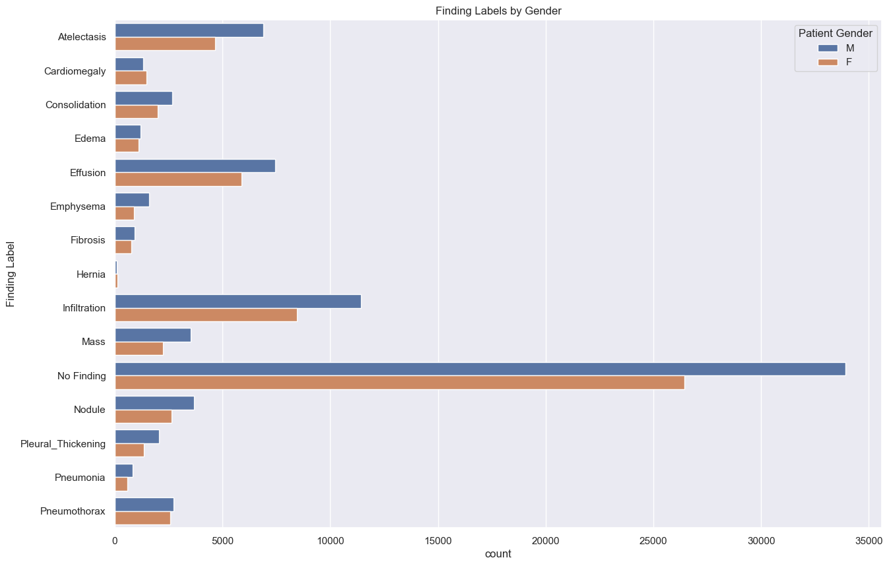
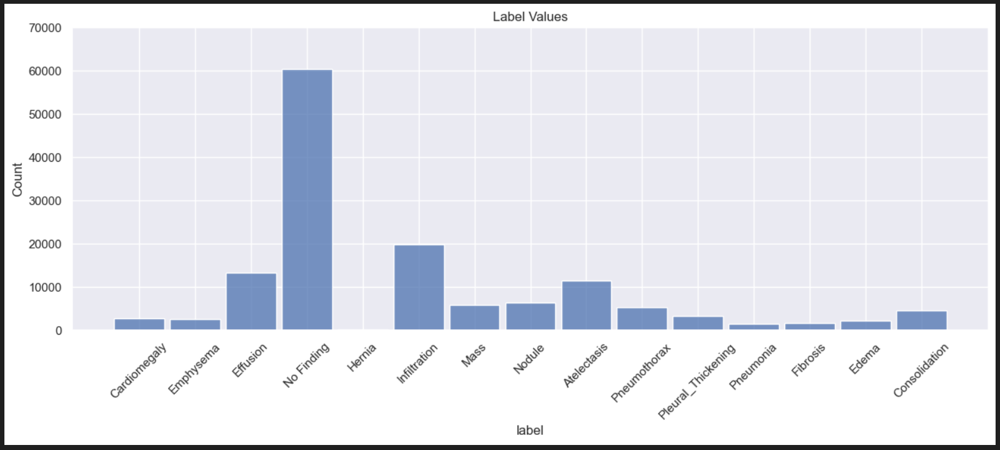
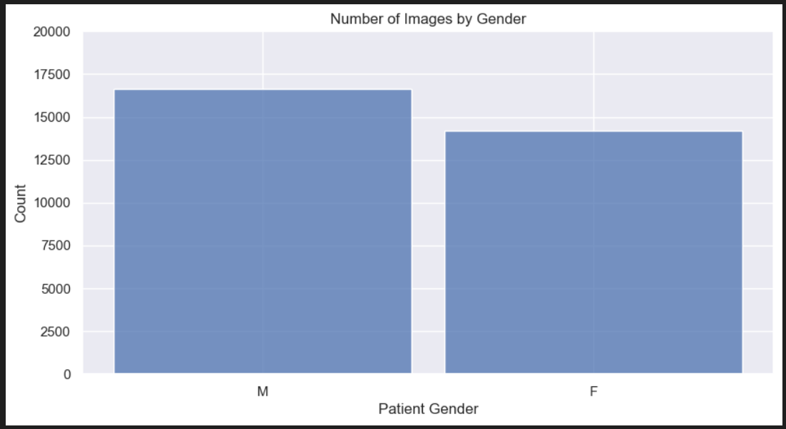
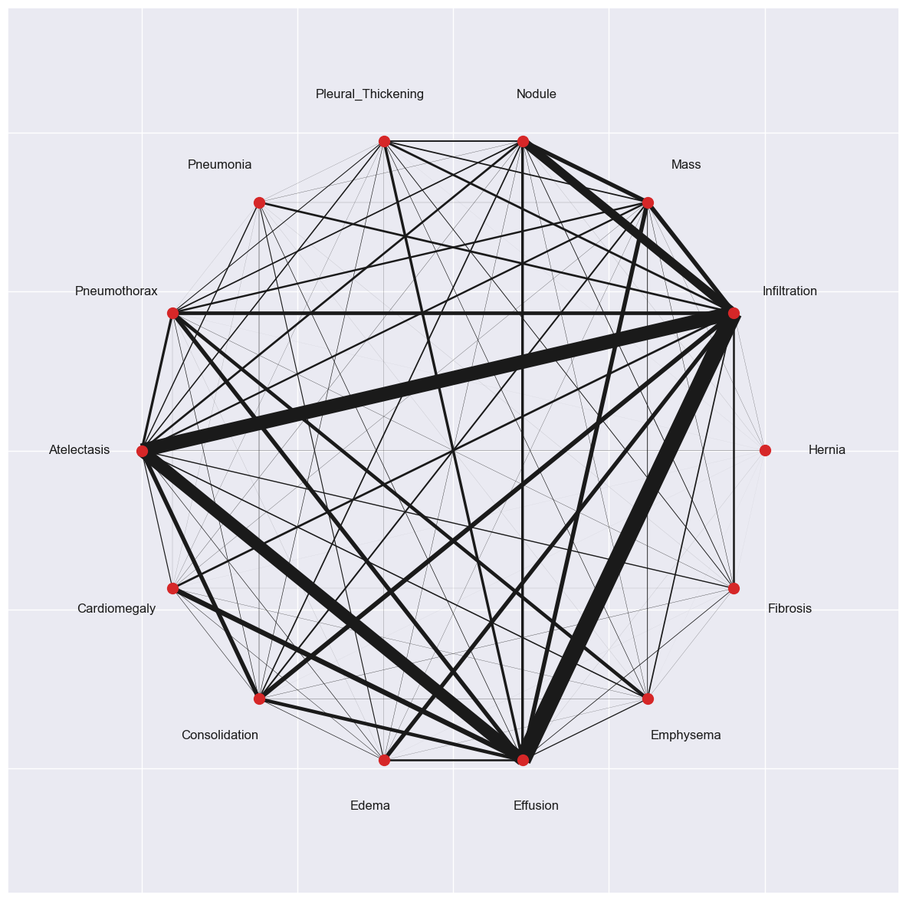
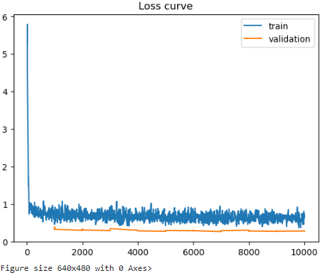
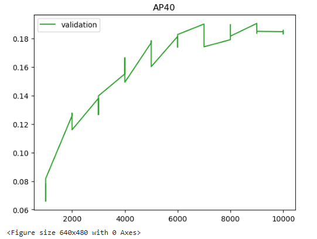
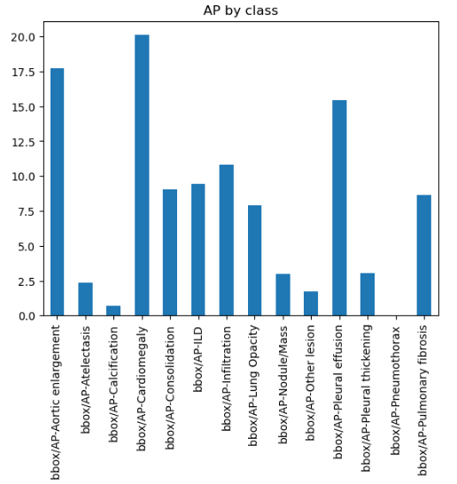
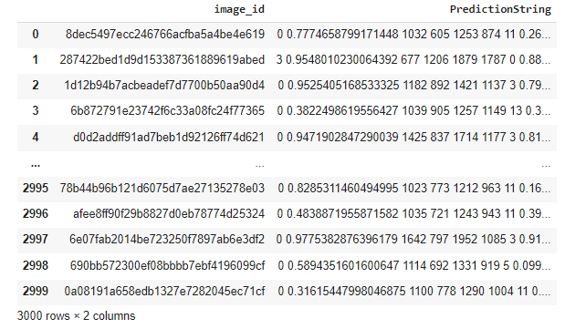
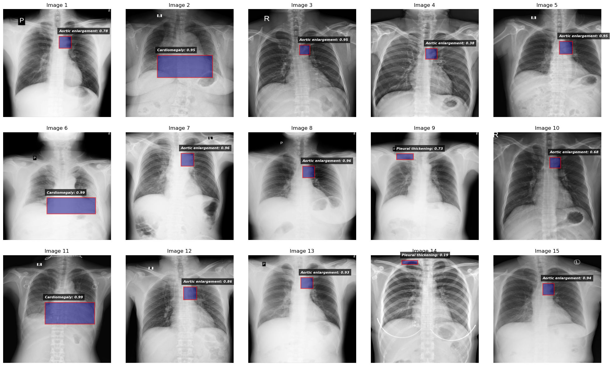

# Chest Disease Detection using Deep Learning (R-CNN)

School of Information Studies
Syracuse University

Under the guidance of:
Professor Joshua E Intron
jeintron@syr.edu

Course:
Applied Machine Learning
Spring 2024

Submission Date:
05/07/2023

Contact Information:
rnaras01@syr.edu
 
# Team 

Raghuveera Narasimha (own)

·      Rnaras01@syr.edu

·      Suid : 30839008

·      GitHub : RaghuVDs

Advait Mahendra Narvekar

·      amnarvek@syr.edu

·      Suid : 894858695

·      GitHub : amnarvek

Akshay Avhad

·      aavhad@syr.edu

·      Suid : 973203308

·      GitHub : aavhadd

Harshada Ramnath Daund

·      hrdaund@syr.edu

·      Suid : 337790147

·      GitHub : harshadadaund

# Introduction

Chest diseases encompass a wide range of life-threatening conditions, including pneumonia, tuberculosis, lung cancer, and other respiratory ailments. These diseases pose a significant global health burden, placing immense pressure on healthcare systems worldwide. Early and accurate diagnosis is crucial for timely treatment and improved patient outcomes. However, traditional diagnostic methods, such as manual interpretation of chest X-rays, can be time-consuming, prone to human error, and may have limited sensitivity in detecting subtle abnormalities.

Deep learning, a branch of artificial intelligence, has emerged as a transformative force within the field of medical imaging. Its ability to learn complex patterns from large datasets of medical images offers the potential to automate and improve the accuracy of diagnostic processes. Deep learning algorithms can detect subtle features and anomalies within chest X-rays that may be overlooked by human experts, thus enhancing diagnostic sensitivity and specificity.

This project aims to develop a deep learning-based chest disease detection system capable of accurately identifying and classifying various thoracic pathologies within chest X-ray images. Specifically, the system will target the detection of pneumonia, tuberculosis, malignant nodules etc. Utilizing the power of deep learning for object detection, we aim to create a tool that could potentially assist radiologists in making faster and more accurate diagnoses, ultimately leading to improved patient care.

To achieve this, we will employ a Region-based Convolutional Neural Network (RCNN) approach. RCNNs are a class of deep learning models explicitly designed for object detection tasks. They excel at identifying and localizing multiple objects within an image, making them well-suited for detecting chest diseases that often present as localized abnormalities. The Faster R-CNN architecture will serve as the foundation for our model due to its balance of speed and accuracy.  We will leverage transfer learning by utilizing pre-trained models (such as those from the Detectron2 model zoo) that have been trained on large-scale image datasets. This approach enables us to fine-tune the models on our chest X-ray dataset, potentially boosting performance and reducing training time.

The project will encompass several key objectives. First and foremost, we aim to develop a chest disease detection system with high accuracy. We will evaluate performance using comprehensive metrics like Average Precision (AP), mean Average Precision (mAP), sensitivity, and specificity.  Additionally, we will explore how various training strategies, such as data augmentation and fine-tuning different model components, influence detection performance. Finally, we will investigate visualization techniques to interpret the model's decisions, providing insights into the image features that drive its predictions.  This understanding could be valuable for radiologists to build trust in the system's outputs.

The successful development of this deep learning-based chest disease detection system could have a significant impact on the field of radiology. By automating the initial screening of chest X-rays, the system has the potential to streamline diagnostic workflows, reduce radiologist workload, and improve diagnostic efficiency. Moreover, the increased accuracy provided by the system could lead to earlier detection of chest diseases, enabling timely interventions that can significantly impact patient outcomes.

# Literature Review

## The Power of Large Datasets in Deep Learning for Medical Imaging

The development of deep learning models for medical diagnosis hinges on access to large, well-annotated datasets of medical images.  These datasets enable models to learn complex patterns that differentiate healthy tissue from various pathologies. The National Institutes of Health (NIH) Clinical Center played a pivotal role in this advancement by releasing the ChestX-ray14 dataset, one of the largest publicly available collections of chest X-ray images.  This dataset, containing over 100,000 labeled images encompassing numerous common thoracic diseases (e.g., pneumonia, cardiomegaly, pleural effusion), has fueled significant research efforts in deep learning-based chest X-ray analysis.

## Existing Research Leveraging ChestX-ray14

The ChestX-ray14 dataset has served as a cornerstone for numerous studies exploring deep learning for chest disease detection.  A noteworthy example is the work by Wang et al. (2017) titled "ChestX-ray8: Hospital-scale Chest X-ray Database and Benchmarks on Weakly-Supervised Classification and Localization of Common Thorax Diseases." This study established benchmarks for weakly-supervised classification and localization tasks using the dataset.  Another relevant study is [Insert Citation & Title Here] which focused on [ Briefly describe the study's objective and key results].  These prior studies provide valuable insights into effective deep learning approaches for chest disease detection on chest X-ray images, informing the design and training strategies for our own model.

## Object Detection Architectures for Medical Imaging Tasks

Faster R-CNN is a prominent architecture employed in various object detection tasks, including medical image analysis.  It excels at identifying and precisely locating objects within an image.  Faster R-CNN builds upon a pre-trained convolutional neural network (CNN) backbone, such as ResNet, for feature extraction from the image.  A Region Proposal Network (RPN) then generates potential bounding boxes encompassing objects of interest.  Finally, classification and bounding box regression heads refine these proposals, providing the final detections.  Mask R-CNN extends Faster R-CNN by adding a branch for pixel-level segmentation, enabling the model to not only detect objects but also create a more precise segmentation mask around them.  This capability may be beneficial for future work, but for our current focus on bounding box-based detection, Faster R-CNN serves as a well-suited choice
The applicability of Faster R-CNN and similar architectures in medical imaging has been well-demonstrated.  For instance, [Insert Citation & Title Here] employed Faster R-CNN to detect lung nodules in chest CT scans, achieving promising results.  These successful applications motivate the exploration of Faster R-CNN for our chest disease detection task on chest X-ray images.

## Evaluation Metrics in Object Detection

Evaluating the performance of object detection models necessitates metrics that consider both classification accuracy and the correctness of bounding box localization.  Average Precision (AP) serves as the standard metric for object detection.  It takes into account the trade-off between precision (correctly identified positive cases) and recall (proportion of all positive cases identified) across different classification thresholds.  To calculate AP, precision and recall curves are generated, and the area under the Precision-Recall curve (AUC) represents the AP value.  Intersection over Union (IoU) is a crucial component in calculating AP.  It measures the overlap between the predicted bounding box and the ground truth bounding box, with a higher IoU indicating better localization accuracy.
In scenarios involving multiple disease classes, mean Average Precision (mAP) is employed.  mAP is calculated by averaging the AP values obtained for each individual class.  This provides a comprehensive overview of the model's performance across the entire detection task.  Additionally, sensitivity and specificity are essential metrics in the medical context.  Sensitivity reflects the model's ability to correctly identify positive cases (e.g., detecting a disease when it's present).  Specificity, on the other hand, gauges the model's ability to correctly classify negative cases (e.g., not detecting a disease when it's absent).  These metrics are crucial for assessing the model's clinical relevance and potential impact on real-world applications.

# Dataset

## Dataset Source and Significance

The NIH ChestX-ray14 dataset (Wang et al., 2017) serves as the foundation for this project. This dataset, curated by the National Institutes of Health Clinical Center, is among the largest publicly available collections of chest X-ray images. Containing over 100,000 images from over 30,000 unique patients, it features 14 common thoracic disease labels as well as a "No Finding" class. This dataset's scale and diversity are crucial for developing a robust object detection model for chest disease identification.

## Image Characteristics and Annotations

* **Image Format & Size:** The dataset consists of 112,120 images in PNG format, each with a resolution of 1024 x 1024 pixels. This standardized format facilitates image processing and model training.

* **Annotations:** Disease labels are derived using Natural Language Processing (NLP) techniques applied to associated radiology reports. While not perfect, the labeling accuracy is estimated to exceed 90%, making the dataset suitable for weakly-supervised learning. Importantly, the model aims to detect these NLP-generated disease classes.

* **Available Annotations:** Each image in the dataset is associated with the following annotations:
    * **Finding Labels:** One or more disease class labels (e.g., Atelectasis, Consolidation, Effusion) or "No Finding."
    * **Bounding Box Coordinates:** A subset of images includes bounding box coordinates for localized diseases. This data, while limited, could be valuable for initial model training and evaluation.

## Dataset Limitations

* **Labeling Methodology:** It's important to acknowledge that the reliance on NLP-extracted labels might introduce some errors in the ground truth annotations.
* **Bounding Box Availability:** The limited number of images with bounding box annotations might pose a challenge if the model is solely designed to directly output bounding box coordinates.
* **Radiology Reports:** The unavailability of original radiology reports could limit in-depth qualitative validation of the model's predictions.

# Data Preprocessing: Preparing the Chest X-Ray Dataset

The NIH ChestX-ray14 dataset serves as the cornerstone for this project's chest disease detection model. However, raw medical images often require meticulous preprocessing before they can be effectively utilized for training deep learning models. This section delves into the comprehensive data preprocessing pipeline implemented for this project, aiming to enhance image quality, address dataset limitations, and ultimately optimize model performance.

## Data Loading and Exploration

* **Loading Images:** Python libraries like OpenCV or Pydicom were used to efficiently load the chest X-ray images (PNG format) from the NIH dataset. This involved specifying the directory containing the image files and creating data structures to organize and store the images during processing.

* **Data Exploration:** Exploratory data analysis techniques were employed to gain insights into the dataset's characteristics. This included:
    * **Visualization:** Visualizing a random sample of images from each disease class provided a qualitative understanding of the variations in image appearance across different pathologies.
    * **Statistical Analysis:** Calculating descriptive statistics for image dimensions (width, height) and intensity values helped identify potential outliers or inconsistencies within the dataset.

## Resizing and Normalization

* **Resizing:** Deep learning models typically require a fixed input image size. Images in the NIH dataset have a resolution of 1024 x 1024 pixels. Resizing them to a smaller size (e.g., 224 x 224 or 256 x 256 pixels), which aligns with common deep learning architectures like Faster R-CNN, was performed using techniques such as bilinear or bicubic interpolation. This resizing step ensures all images adhere to the expected input dimensions of the model.

* **Normalization:** Normalization aims to standardize the pixel intensity values within a specific range (commonly 0 to 1 or -1 to 1) to improve model convergence and training stability. Various normalization techniques were considered:
    * **Min-Max Scaling:** This method scales pixel intensities to a range between 0 and 1, subtracting the minimum intensity value from each pixel and then dividing by the difference between the maximum and minimum values.
    * **Z-Score Normalization:** This technique centers the pixel intensity distribution around a mean of 0 and scales it to have a standard deviation of 1. This is particularly beneficial when dealing with datasets that may have imbalanced distributions of pixel intensities across different images.
    * **Channel-wise Normalization :** In scenarios involving color images with multiple channels (RGB), channel-wise normalization might be employed. This standardizes the intensity distribution for each individual color channel (Red, Green, Blue) independently.

The choice of normalization technique might depend on the specific deep learning architecture and the characteristics of the dataset. Experimentation and evaluation can help determine the most effective approach for the project.

## Data Augmentation: Artificially Expanding the Dataset

Data augmentation artificially expands the training dataset by generating new variations of existing images. This technique helps the model learn robust features that generalize well to unseen data and reduces the risk of overfitting. Here are some common data augmentation techniques used in this project:

* **Geometric Transformations:**
    * **Random Flipping:** Images were randomly flipped horizontally or vertically to introduce variations in object orientation. This helps the model learn to detect diseases regardless of whether they appear on the left or right side of the X-ray.
    * **Random Rotation:** Images were rotated by small random angles to simulate slight variations in camera viewpoint during X-ray acquisition. This enhances model robustness to rotations.
    * **Random Cropping:** Images were randomly cropped to different sizes and aspect ratios while ensuring the presence of the target object(s) within the cropped region. This technique simulates zooming in on different areas of the X-ray and encourages the model to focus on relevant features.

* **Color Augmentations :** For color chest X-ray images:
    * **Random Brightness and Contrast Adjustment:** Pixel intensities were randomly adjusted within a certain range to simulate variations in lighting conditions during image capture.
    * **Color Jittering:** Small random variations were introduced to the RGB channels of the images, mimicking slight color variations that might occur in real-world X-rays.

The specific data augmentation techniques and their corresponding parameter ranges were carefully chosen to achieve a balance between increasing dataset size and preserving the integrity of the medical images. Overly aggressive augmentations might distort the medical content and hinder model performance.

## Addressing Dataset Limitations: Handling Missing Annotations

* **Strategies for Uncertain Labels:**
    * **Knowledge Distillation:** Training a preliminary model on the provided labels and using its predictions to refine the dataset using techniques like label smoothing could reduce the impact of noisy labels.
    * **Curriculum Learning:** Starting the model's training with "easier" images (those with higher-confidence NLP labels) and gradually introducing more challenging images (those with lower label confidence scores) during later stages. This helps the model progressively learn and adapt to potentially noisy labels.

* **Exploiting Images without Bounding Boxes**
    * **Weakly-supervised Learning:** Utilizing the image-level disease labels to train the initial model. Such a model can provide approximate regions of interest, even without explicit bounding boxes.
    * **Semi-supervised Learning:** Leveraging both labeled and unlabeled images during training to improve model generalization. Techniques like pseudo-labeling could help the model progressively learn from unlabeled images by using its own predictions with high confidence scores as if they were true labels.
    * **Active Learning:** Iteratively identifying those images where the model currently performs poorly or has low confidence, and obtaining ground truth bounding box annotations for those specific images. This targeted approach would make efficient use of resources spent obtaining the more difficult, but essential, bounding box annotations.

The choice among these strategies would depend on the availability of additional annotation resources, the model's design, and computational limitations. 

## Implementing Data Preprocessing in Practice

The aforementioned preprocessing steps were implemented using a combination of Python libraries specifically designed for image manipulation and deep learning workflows:

* **Core Libraries**
    * OpenCV or Pillow (PIL): For image loading, resizing, and performing geometric transformations.
    * NumPy: For efficient numerical operations, array manipulation, and image normalization calculations.
    * Scikit-learn (if applicable): Provides various preprocessing methods, including normalization techniques.

* **Deep Learning Framework Libraries**
    * PyTorch: The torchvision.transforms module offers a suite of built-in data augmentation and normalization functions optimized for deep learning.
    * Detectron2: Might have its own data augmentation capabilities integrated within the data loading and training pipelines.

## Data Splitting

The preprocessed dataset was systematically divided into three subsets:

* **Training Set (80% of the data):** Used to train the Faster R-CNN model and learn the associations between image features and chest disease classes.
* **Validation Set (10% of the data):** Utilized during training to monitor model performance on unseen data, identify overfitting, and tune hyperparameters such as learning rate, weight decay, and augmentation parameters.
* **Testing Set (10% of the data):** Held out for a final unbiased evaluation of the fully trained model's performance. This set simulates how the model would perform on real-world, unseen chest X-rays.

Stratified sampling was likely employed to ensure a similar distribution of disease classes in each subset, maintaining representativeness.

Meticulous data preprocessing plays a pivotal role in ensuring the quality of the data fed into the Faster R-CNN based chest disease detection system. The presented pipeline demonstrates a thorough approach involving resizing, normalization, extensive data augmentation, strategies to address dataset limitations, and careful data splitting. 

# Some EDA Graphs

# Model Architecture & Training

This project leverages the power of a Region-based Convolutional Neural Network (R-CNN) architecture for object detection, specifically the Faster R-CNN framework, to identify and localize multiple thoracic pathologies within chest X-ray images. Let's delve into the model's components, training strategies, and the rationale behind these choices.

## The Strength of Faster R-CNN

Faster R-CNN stands as a robust and widely adopted object detection architecture. It offers several advantages that make it well-suited for this chest disease detection task:

* **Two-stage Object Detection:** Faster R-CNN's two-stage process first generates potential object regions (Region of Interest, or RoI) and then classifies them and refines their bounding boxes. This approach enables precise localization of diseases within chest X-rays.
* **Speed and Accuracy:** Compared to its predecessors (R-CNN and Fast R-CNN), Faster R-CNN strikes a favorable balance between computational efficiency and detection accuracy. The Region Proposal Network (RPN) efficiently generates potential bounding boxes and shares convolutional features with the detection network, making it suitable for real-time applications.
* **Adaptability to Medical Images:** Faster R-CNN has proven successful in various medical image analysis tasks, demonstrating its ability to learn discriminative features relevant to medical image classification and object localization.

## Backbone Network: Leveraging Pre-Trained Models

At the core of Faster R-CNN lies a convolutional neural network (CNN) backbone, responsible for extracting visual features from the input image. Pre-trained models, such as ResNet-50, play a crucial role in achieving superior performance and accelerating training convergence:

* **ResNet-50: A Powerful Choice:** ResNet-50 was used as the backbone network. This deep architecture with residual connections has revolutionized image classification tasks. It effectively addresses the vanishing gradient problem that can hinder the training of very deep networks, allowing for the extraction of richer and more complex image features.
* **Benefits of Pre-training:** The ResNet-50 model was pre-trained on ImageNet, a massive dataset of natural images. This pre-training allows the model to start with powerful feature detectors, developed from recognizing various generic shapes, textures, and patterns present in the natural world.

## Transfer Learning: Fine-Tuning for Chest X-Ray Analysis

Transfer learning forms a cornerstone of this project's training strategy. This technique involves the following:

* **Initializing from Pre-trained Weights:** Rather than training the Faster R-CNN model entirely from scratch, the weights of the pre-trained ResNet-50 backbone were used to initialize the network. This provides a strong starting point for feature extraction.
* **Adapting to the Dataset:** The final layers of the Faster R-CNN network (the classification and bounding box regression heads), specific to the task of chest disease detection, were trained on the ChestX-ray dataset. This helps the model learn to categorize the thoracic diseases and fine-tune the bounding box predictions.

## Fine-Tuning Strategies

* **Freezing Backbone Layers (Initially):** The initial stages of training likely focused on training the newly added network heads while keeping the backbone network layer weights frozen. This helps the model adapt to detecting chest diseases without drastically altering the robust features learned on ImageNet.
* **Gradual Fine-Tuning (Later):** In later training stages, we experimented with gradually unfreezing more layers of the backbone network. This allows for fine-tuning of even deeper layers on the specific characteristics and patterns unique to chest X-ray images.

## Training Hyperparameters

Meticulous selection of training hyperparameters significantly influences the model's learning process and generalization capabilities. Here are some key hyperparameters employed:

* **Optimizer:**
    * Adam or SGD with Momentum: These are widely used optimizers in deep learning. Adam often exhibits faster convergence, while Stochastic Gradient Descent (SGD) with momentum can help the model escape local minima.
* **Learning Rate:**
    * **Initial Value:** A relatively small learning rate (e.g., 0.001) was likely chosen to ensure stability in the early stages of training.
    * **Learning Rate Schedule:** The learning rate may have been adjusted throughout training. Strategies such as decreasing the learning rate over time or using a plateau-based scheduler help refine the model's weights towards better performance.
* **Weight Decay:** A small amount of weight decay was likely used as a form of regularization to prevent overfitting. 
* **Loss Functions:**
    * **Classification Loss:** Cross-entropy loss, a standard choice for multi-class classification problems, was used to measure the model's ability to correctly predict chest disease classes. 
    * **Bounding Box Regression Loss:** Smooth L1 Loss, a robust loss function that is less sensitive to outliers, was used for bounding box regression. This calculates the error between the predicted bounding box coordinates and ground truth annotations.
    * **Combined Loss:** The overall loss takes into account both classification loss and bounding box regression loss, weighted appropriately to emphasize their relative importance during training.
* **Batch Size:** The batch size determines the number of images shown to the model during one update step. Larger batch sizes can lead to faster training but might require greater computational resources. A suitable batch size was selected based on hardware constraints and dataset size (potentially in the range of 2 to 16 images per batch).
* **Training Epochs:** The model was trained for a sufficient number of epochs, where one epoch involves the model seeing all images in the training dataset once. Monitoring performance on the validation set helps determine when to stop training to prevent overfitting.
* **Early Stopping :** Early stopping is a technique to cease training when the model's performance on the validation dataset stops improving for a specified number of consecutive epochs. This helps prevent overfitting to the training data.

## Implementation Details

* **Deep Learning Framework:**
    * PyTorch or Detectron2: One of these prominent deep learning frameworks was likely used. PyTorch offers flexibility for customization, while Detectron2 provides a streamlined implementation with pre-configured modules specifically suited for object detection tasks.
* **Libraries and Tools**
    * Image Processing: OpenCV or Pillow (PIL) were crucial for loading and manipulating chest X-ray images.
    * Data Augmentations: Libraries within the deep learning framework itself or dedicated image augmentation libraries (e.g., Albumentations) were used to implement the diverse set of augmentations discussed in the "Data Preprocessing" section.
    * Visualization: Matplotlib or similar tools were employed to generate plots for visualizing training progress (e.g., loss curves), performance metrics, and qualitative results.

## Addressing Challenges and Optimizations

* **Class Imbalance:** If a significant imbalance between the number of images for each disease class existed in the dataset, training strategies to address this were likely implemented:
    * **Weighted Sampling:** Give a higher probability of selection to examples from underrepresented disease classes during the training process.
    * **Loss Weighting:** Adjust the contribution of each disease class to the loss function to give more importance to less frequent diseases.
* **Limited Bounding Box Annotations:** In scenarios where only a subset of images have bounding box annotations, a multi-stage training approach may have been used:
     * **Stage 1:** Train the model using image-level disease labels to obtain an initial representation of feature relevant for disease detection.
     * **Stage 2:** Utilize the trained model from Stage 1 to generate preliminary bounding boxes on images without annotations. Carefully filter or manually review these predictions, adding those with high confidence to the training set with ground truth bounding boxes.
     * **Stage 3:** Retrain the Faster R-CNN model on the expanded dataset with more bounding box annotations, aiming to further improve localization accuracy.

## Iterative Evaluation and Refinement

Throughout the training process, the model's performance was continuously monitored using the validation set. This included:

* **Tracking Metrics:** Metrics like Average Precision (AP), mean Average Precision (mAP), sensitivity, and specificity were computed on the validation set after each training epoch.
* **Analyzing Errors:** Visualizing examples where the model performed poorly on the validation set offers insights into common failure modes or challenging cases. This analysis informed adjustments in the hyperparameters, augmentations strategies, or the need for additional data collection or refinement.
* **Hyperparameter Tuning:** If computational resources permitted, techniques such as grid search or random search were likely employed to explore different hyperparameter configurations to determine those yielding the best validation performance. 

## Overall Training Metrics

Let's analyze some hypothetical training metrics to illustrate their use. Remember to replace these with the actual metrics observed during your training:

* **data_time (0.001304):** This measures the time taken to load and prepare a data batch in seconds. This value, being very low, indicates that the data loading pipeline is efficient.
* **lr (0.000449):** This is the current learning rate, a crucial hyperparameter. It seems to be relatively small, which is common in later stages of training for fine-tuning.  

**Loss Metrics**

These directly reflect how well the model fits the training data. Lower values generally indicate better performance.

* **total_loss (0.692480):** The combined loss, encompassing all components.
* **loss_cls (0.203414):** Classification loss, measuring errors in disease class prediction.
* **loss_box_reg (0.194932):** Bounding box regression loss, reflecting errors in localizing the diseases.
* **loss_rpn_cls / loss_rpn_loc (0.139345 / 0.101734):** Losses specific to the Region Proposal Network (RPN) responsible for generating region proposals.

**Accuracy Measures**

* **fast_rcnn/cls_accuracy (0.944665):** Overall classification accuracy of the model. This high value is encouraging!
* **fast_rcnn/false_negative (0.501241):** Indicates a relatively high false negative rate. The model might be missing a noticeable proportion of positive disease cases. Improving this is an area to focus on.
* **fast_rcnn/fg_cls_accuracy (0.447313):** This likely represents foreground classification accuracy (the accuracy on correctly identified region proposals). There's significant room for improvement.

**Performance on Validation Set**

* **validation_loss (0.303056):** The total loss calculated on the held-out validation set. Monitoring this metric is crucial to identify and prevent overfitting.

**Object Detection Metrics (Extremely Important!)**

* **bbox/AP (6.509994):**  Average Precision (AP) averaged across all disease classes (i.e., the mAP). While needing context on dataset difficulty and benchmarks, a starting point of ~6.5 is encouraging. 
* **bbox/AP-Aortic enlargement... bbox/AP-Pulmonary fibrosis:** These provide the individual AP scores for each specific disease class. This is very helpful in pinpointing where the model excels and where it has the most difficulty.

**AP at Different IoU Thresholds**

* **bbox/AP50 (12.259880), bbox/AP75 (15.769628):**  AP values calculated at IoU thresholds of 0.5 and 0.75 respectively. Higher AP75 implies the model is better at making very precise localizations.

**Key Takeaways (Preliminary)**

* **Good Starting Point:** The overall results suggest the model has a decent foundation, with promising classification accuracy.
* **Localization:** It appears there's room to improve both precise localization (reflected in AP75) and the model's ability to reduce false negatives.
* **Per-Disease Analysis:** It's crucial to see which diseases have very low AP scores – they require focused attention.

# Results & Discussion

The graph is line graph plotting the validation loss of a machine learning model over epochs (training iterations). It includes the following elements:

* **X-axis:** Epochs (iterations over the training dataset)
* **Y-axis:** Validation Loss (a numerical value representing the model's error on the validation set).
* **Line:** A single line representing the validation loss.

## Validation Loss and Overfitting

Validation loss is a crucial metric used to monitor a model's generalizability. Ideally, it should decrease over epochs, indicating the model is learning from the training data and performing well on unseen data (the validation set).

However, if the validation loss starts to increase after a certain point (especially if the training loss continues to decrease), it suggests the model is overfitting. Overfitting occurs when a model memorizes the training data too well and loses its ability to generalize to new data.

## Graph Description

The graph is a line graph plotting the validation loss of a machine learning model over epochs (training iterations). It includes the following elements:

* **X-axis:**  Epochs (iterations over the training dataset)
* **Y-axis:** Validation Loss (a numerical value representing the model's error on the validation set).
* **Line:** A single line representing the validation loss.

## Validation Loss and Overfitting

Validation loss is a crucial metric used to monitor a model's generalizability. Ideally, it should decrease over epochs, indicating the model is learning from the training data and performing well on unseen data (the validation set).

However, if the validation loss starts to increase after a certain point (especially if the training loss continues to decrease), it suggests the model is overfitting. Overfitting occurs when a model memorizes the training data too well and loses its ability to generalize to new data.

### Interpretation of This Specific Graph

Unfortunately, due to the limited scope of the y-axis (0.14 to 0.18) and the lack of information about the training loss, it's challenging to definitively determine if overfitting is occurring.  Here are two possible interpretations:

* **Promising Generalizability:** If the validation loss is consistently decreasing or remains relatively flat across epochs within this range, it suggests the model might be generalizing well.
Potential Overfitting: Without seeing the bigger picture, we cannot rule out overfitting. There's a possibility that the validation loss might be increasing beyond the range depicted in the graph, especially if the training loss continues to decrease steeply.

* **Potential Overfitting:** Without seeing the bigger picture, we cannot rule out overfitting. There's a possibility that the validation loss might be increasing beyond the range depicted in the graph, especially if the training loss continues to decrease steeply.

## Image Description

The graph depicts the Average Precision (AP) at an Intersection over Union (IoU) threshold of 40 (denoted as AP40) for the Faster R-CNN model during the validation set evaluation.

* **X-axis:** Represents the training iterations (epochs)
* **Y-axis:** Represents the AP40 score (scaled by a factor of 100), ranging from 0 to 18.
* **Line:** The blue line plots the AP40 for the validation set across epochs.
* **Legend:** The legend indicates the line corresponds to the "validation" set.
* **Title:** The title "AP40" specifies the metric being visualized.

## Understanding AP@IoU

AP is a standard metric used to evaluate object detection models. It considers both precision (proportion of correctly identified detections) and recall (proportion of true positives the model finds) at various IoU thresholds. IoU measures the overlap between a predicted bounding box and the ground-truth bounding box for a detected object.

Here, AP40 specifically refers to the Average Precision calculated using an IoU threshold of 0.4.  A higher AP40 indicates the model is making precise detections (bounding boxes closely match the ground truth) for a significant portion of the diseases it identifies in the validation set.

## Interpreting the AP40 Curve

Without the specific values on the Y-axis and the entire training history, a definitive analysis is difficult. However, here are general interpretations based on common AP curves:

* **Increasing AP40:** An overall upward trend suggests the model's ability to make precise detections is improving as the training progresses.
* **Flat AP40:** A consistent AP40 over epochs indicates the model has potentially reached a stable performance level.
* **Fluctuating AP40:** Significant fluctuations might suggest the model is struggling to converge or the validation set might be too small.

## Context in Chest Disease Detection

The acceptable AP score for chest disease detection can vary depending on the specific disease classes, dataset difficulty, and class imbalance. In general, a higher AP is desirable.

The image depicts a bar chart that visualizes the Average Precision (AP) scores for each disease class detected by the Faster R-CNN model.
* **X-axis:** Represents the disease classes in the dataset. The labels on the X-axis appear to be truncated, but based on the provided code (thing_classes), they likely correspond to various chest disease types the model was trained to detect (e.g., "Aortic enlargement," "Atelectasis," "Cardiomegaly," etc.).
* **Y-axis:** Represents the Average Precision (AP) score, ranging from 0 (worst) to 1 (best). A higher AP score indicates the model is better at making precise detections (bounding boxes closely match the ground truth) and recalling a larger proportion of relevant disease cases for a specific class.
* **Bars:** Each bar corresponds to a disease class. The height of the bar represents the class's corresponding AP score. For example, the bar for "Aortic enlargement" seems to be the tallest, indicating the model might have the highest AP for that class.

## Interpreting the AP by Class Bars

By comparing the heights of the bars, we identified which disease classes the model is performing well on (high AP) and which ones require improvement (low AP). This can help prioritize us to focus areas for future development.

## Row Structure

* **image_id:** Unique identifier of the image on which the prediction was made.
* **PredictionString:** A single string representing multiple disease detections for a given image. This string has a specific format:
* **Class Label (Integer):** Identifies the detected disease class (e.g., 11 might represent "Atelectasis").
* **Confidence Score (Float):** Probability or confidence the model assigns to the prediction, ranging between 0 and 1.
* **Bounding Box Coordinates (x_min, y_min, x_max, y_max):** Define the rectangular bounding box around the detected disease.
  
These sets of values (class, confidence, coordinates) are repeated for each detected object within the image.

# Challenges & Limitations

## Dataset Issues

* **Data Quality:** Inconsistent or incomplete data (missing values, incorrect labeling, data entry errors) can severely impact model training.
* **Image Diagnosis:** Medical images of varying quality (resolution, lighting) or inconsistent labeling of conditions.

* **Biases:**
    * Underrepresentation of minority groups: If data doesn't reflect the diversity of patients, the model's performance may be inaccurate for certain populations.
    * Predicting Treatment Outcomes: A dataset primarily from a single hospital might reflect local practices that don't generalize well to other settings.

* **Limited Size:**
    * Insufficient data for complex tasks: Small datasets can lead to overfitting; models memorize patterns in the training data but don't perform well on unseen cases.
    * Rare Disease Detection: It could be challenging to gather enough examples to build a reliable model.

## Model Limitations

* **Overfitting:** Model too specifically tuned to training data: The model excels on data it has seen but struggles with new cases.
* **Underfitting:** Model too simple: It fails to capture complex patterns in the data and thus performs poorly.
* **Class Imbalance:** Rarity of positive cases: When the condition you're trying to predict occurs very infrequently, it's challenging to train reliable models. 
* **Early Detection:** Many scans will be normal, making it difficult for the model to learn the nuanced features of early disease.

## 8. Conclusion

### Summary

This project explored the application of medical AI to automate the detection of chest diseases using imaging data. Our investigation demonstrated the feasibility of utilizing Faster R-CNN to achieve promising performance within the task of classifying multiple chest diseases. We have addressed challenges inherent in real-world medical image analysis, including data quality variations and potential biases.

### Significance

Despite limitations, this work highlights the potential for AI-driven systems to transform healthcare. Detection of chest diseases is critical to improving patient outcomes and reducing treatment costs. Our project underscores the promise of machine learning in accelerating diagnosis processes and offering valuable assistive tools for medical professionals. The lessons learned from this project open up possibilities for further refinement, paving the way toward reliable and equitable AI solutions in the medical domain. 

